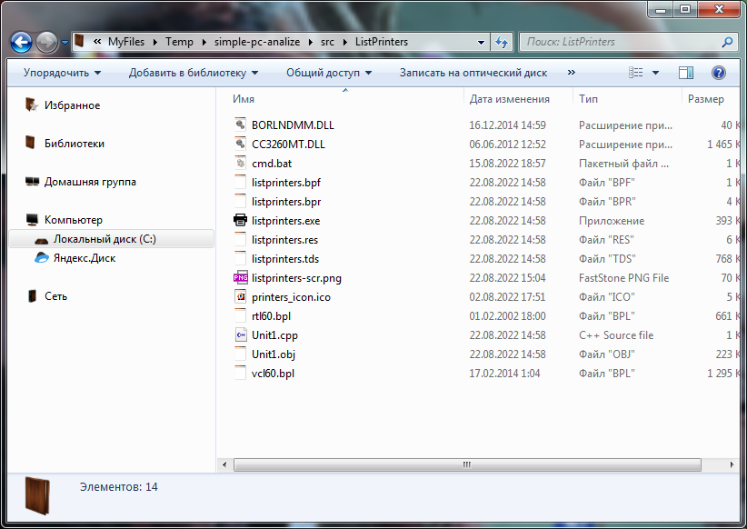
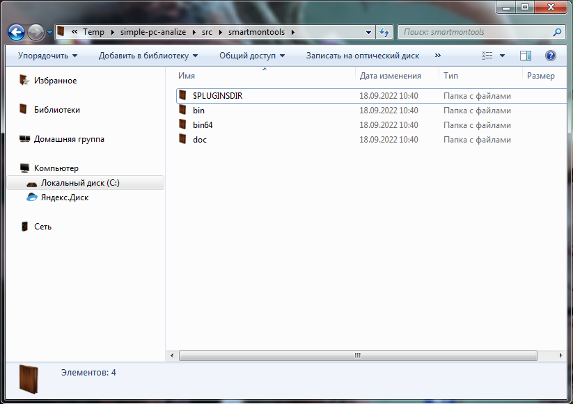

# simple-pc-analize

---


Консольная программа для сбора информации о компьютере и записи ее в файл журнала.

Программа предназначена только для **ОС Windows**. Для реализации использован **Python** версии **3.8.9 и старше**.

  

<a name="Oglavlenie"></a>

## Оглавление

1. [Введение](#Intro)
2. [Зависимости](#Dependencies)
3. [Компиляция](#Compilation)
4. [Использование](#Uses)
5. [Обо мне](#About)

## <a name="Intro">Введение</a>

Данная программа предназначена для сбора минимально необходимой информации о ПК для какой-либо организации. Да, существуют масса утилит подобного характера. Однако, именно эта программа должна заменить использование сразу нескольких приложений. 

В подавляющем большинстве случаев в *Windows* существуют масса сбоев различных драйверов при частом к ним обращении из приложений пользователей. 

В достаточно старых ПК (например, с оперативной памятью DDR-2) довольно часто происходят сбои связанные с принтерами. 

В организациях при частых операциях, связанных с файлами и локальных HDD дисков (не SSD), необходимо регулярно контролировать **уровень фрагментации локальных дисков**, а также состояние **SMART** этих дисков и оставшееся свободное место.

При использовании доступов к тем или иным базам данных в организациях часто можно встретить переадресацию в файле **hosts**, который также необходимо контролировать. В связи с чем возникает и следующая необходимость контролировать доступ к веб-адресам этих баз данных. В случаях сбоев - сразу же устранять неисправность.

Далеко не все утилиты диагностики подерживают весь указанный функционал. А если учесть постоянное расширение доступов к различным ресурсам и необходимость контроля последних - очевидна необходимость универсального решения. Данная утилита как раз и призвана решить все указанные вопросы.

---

[К оглавлению](#Oglavlenie)

## <a name="Dependencies">Зависимости</a>

В программе автоматически определяется архитекутура **ОС**.

Внутри директории **src** программы обязательно должны присутствовать следующие папки и файлы. Без них программа работать не будет. Скачанные архивы и **exe** файлы для работы не нужны, т.е. их в последствии можно будет удалить.

* ListPrinters ([Git ссылка](https://github.com/maximalisimus/ListPrinters.git))
* FastPing ([Git ссылка](https://github.com/maximalisimus/FastPing.git))
* udefrag-x64 ([Sourceforge.net](https://sourceforge.net/projects/ultradefrag/files/stable-release/))
* udefrag-x86 ([Sourceforge.net](https://sourceforge.net/projects/ultradefrag/files/stable-release/))
* smartmontools ([Sourceforge.net](https://sourceforge.net/projects/smartmontools/files/smartmontools/))
* ping-list.txt
* structure.txt

А теперь о каждом пункте отдельно. Начнем с конца.

**structure.txt** - Вы можете не использовать структурирование файлов журнала по структуре организации, но файл в папке с программой обязательно должен присутствовать. 

**ping-list.txt** - то же самое касательно пингов различных веб адресов. Пинги можно отключить соответствующим ключом, или просто оставить в файле буквально 1...2 строчки. Однако, файл обязательно должен присутствовать.

  **ListPrinters** - отдельная программа написанная на **C++Buileder**-ре  .
 
 Компилировать её не нужно. Написана мною. Просто скачайте последнюю [Relese версию](https://github.com/maximalisimus/ListPrinters/releases/download/v1.0.0.0/ListPrinters-win-x86.exe) в папку **src**. Не нужно создавать никаких директорий. Данный *exe* является архивом, который упакован *7z* как *sfx* архив. Внутри уже имеются все необходимые файлы и папки для работы программы. 
 
 Поэтому просто запустите его внутри **src** папки и распакуйте.
 

 
   **FastPing** - также отдельная программа написанная на **C++Buileder**-ре  .

 Компилировать её не нужно. Написана тоже мною. Просто скачайте последнюю [Relese версию](https://github.com/maximalisimus/FastPing/releases/download/v1.0.0.0/FastPing-win-x86.exe) в папку **src**. Не нужно создавать никаких директорий. Данный *exe* является архивом, который упакован *7z* как *sfx* архив. Внутри уже имеются все необходимые файлы и папки для работы программы. 
 
 Поэтому просто запустите его внутри **src** папки и распакуйте.


Мною протестировано около 10-ка различных утилит для анализа и дефрагментации дисков. Среди данного списка программ выявлена лишь одна наиболее стабильная утилита с достаточно глубоким и наиболее точным анаизом локальных дисков - причем не графическая версия **UltraDefrag Files** - а именно консольная часть утилиты - **udefrag**.

Предпочтительнее использовать именно консольные версии дефрагментации дисков **udefrag.exe**, а не их графические версии **ultradefrag.exe** или встроенные в **Windows** - **DEFRAG.exe**, т.к. именно консольная **udefrag.exe**, на мой субъективный взгляд, работает стабильнее, быстрее и лучше любой другой утилиты. 

В отличии от **Auslogics Disk Defrag** данная утилита **udefrag** более глубоко анализирует уровень фрагментации дисков, даже при условии использования ключей и параметров командной строки для низкоуровневого анализа. **Auslogics** же напротив, как мне кажется, работает слишком поверхностно. В то время как **DEFRAG.exe** встроенная в любой **Windows** работает слишком долго, чем отнимает драгоценное время пользователя.

**udefrag-x64** и **udefrag-x86** являются частью утилиты **UltraDefrag Files**.  Эту портативную версию утилиты в зависимости от архитектуры можно скачать с сайта *SorceForge.Net*. Однако, вся утилита не нужна. 

В списке выше указана ссылка на все версии утитилы, чтобы можно было выбрать последнюю. На данный момент последней является версия **7.1.4**.

Скачать необходимо 2 архива:
* с окончанием *bin.i386.zip*, например [этот](https://sourceforge.net/projects/ultradefrag/files/stable-release/7.1.4/ultradefrag-portable-7.1.4.bin.i386.zip/download)
* и с окончанием *bin.amd64.zip*, например [этот](https://sourceforge.net/projects/ultradefrag/files/stable-release/7.1.4/ultradefrag-portable-7.1.4.bin.amd64.zip/download)

Далее, в папке *src* создайте 2 директории - *udefrag-x64* и *udefrag-x86*. После этого распакуйте файлы программы *Ultra defrag* в эти папки по архитектурам. Нужны не все файы. 

Вот список необходимых файлов любого архива:
* conf
* po
* scripts
* lua5.1a.dll
* lua5.1a.exe
* lua5.1a_gui.exe
* udefrag.dll
* udefrag.exe
* zenwinx.dll

Папка **reports** создаётся автоматически в процессе работы. Файл **cmd.bat** - я создал сам - для запуска утилиты **udefrag.exe** вручную из командной строки от имени адмнистратора, при таковой необходимости. Т.е. в случае необходимости дефрагментации дисков. 

Содержимое *cmd.bat* файла:

```
@cd/d "%~dp0"
@echo off
cmd.exe
```


**smartmontools** - это полноценная утилита **S.M.A.R.T. Monitoring Tools Files**. Скачать можно, также с [Sourceforge.net](https://sourceforge.net/projects/smartmontools/files/smartmontools/).

На данный момент актуальной является версия **7.3**.
Её также как и *UltraDefrag* необходимо скачать, но в этот раз **Setup** файл, например, [Вот этот](https://sourceforge.net/projects/smartmontools/files/smartmontools/7.3/smartmontools-7.3-1.win32-setup.exe/download).

В **src** необходимо создать директорию **smartmontools**.

Теперь откройте скачанный **setup** файл с помощью **7z** архиавтора правой кнопкой мыши и распакуйте все файлы в созданную директорию **smartmontools**. При условии, что у вас установлен **7z**.

Должно получиться как на скриншоте ниже.



Скриншот с итоговым видом всех необходимых файлов и папок.


Для работы программы обязательно необходимы следующие **PIP** модули:

* pywin32
* pywin32-ctypes
* colorama

Для компиляции программы в исполняемый файл **EXE** предпочтительно использовать **PIP** модуль **pyinstaller**.

---

[К оглавлению](#Oglavlenie)

## <a name="Compilation">Компиляция</a>

Для компиляции и вашего же удобства создайте в корне этого репозитория *cmd.bat* файл, в котором необходимо добавить в переменную среды  *Windows PATH* путь к вашему *Python*-у, версии начиная с *3.8.9* и старше.

Вполне можно использовать и портативную версию **Python**-а, скачанного с сайта [Sourceforge.net](https://sourceforge.net/projects/portable-python/files/).

Обратите внимание, что во избежание проблем с запуском самого *Python* как такого только в **Windows 7** необходимо использовать версию **НЕ ВЫШЕ 3.8.9**. В **Windows 10** рекомендуется использовать последнюю версию - на данный момент это **3.10.5**.

Итак, вы скачали [Python 3.8.9 x86](https://sourceforge.net/projects/portable-python/files/Portable%20Python%203.8/Portable%20Python-3.8.9.exe/download) или [Python 3.8.9 x64](https://sourceforge.net/projects/portable-python/files/Portable%20Python%203.8/Portable%20Python-3.8.9%20x64.exe/download). 

Для любой скачанной версии - что делать дальше?

В любой версии **Winodws** путь к вашему **Python** не должен содержать пробелов. Т.е. не допустимо устанавливать или распаковать в директории типа **«Program Files»** или **«Program Files (x86)»**. В именах папок не должно быть пробелов. Допустимо, чтобы было, например **«Program_Files»** или **«Program-Files»**. 

Этот момент также необходимо соблюдать во избежание проблем с запуском самого **Python** как такового, повторюсь в любой версии **Winodws**.

В качестве примера просто создайте в корне вашего локального диска с системой (например, **C:\\**) следующую структуру папок, например такую:

* C:\Portable-Programs\Python-3.8.9-x86\
* C:\Portable-Programs\Python-3.8.9-x64\

Скачанный *exe* файл является *sfx* архивом, который упакован с помощью архиавтора *7z*.

Далее отройте этот *exe* файл с помощью архиватора *7z* правой кнопкой мыши - меню *7z* - открыть архив. Это не обязательно, можно просто запустить файл - распаковать куда-нибудь, а затем переместить только необходимые файлы и папки.

Итак, внутри открытого *sfx* архива имеются вложенные папки. Нам нужны далеко не все файлы. Зайдите в *Portable Python-номер-версии* (например, Portable Python-3.8.9 x64), затем в *App* и *Python*. Вот именно эти все файлы и папки как раз и нужны.

Теперь выделите все файлы и папки и распакуйте согласно архитектуре в созданную выше одну из папок в вашем локальном диске, например **C:\Portable-Programs\Python-3.8.9-x86** один **exe** архив и / или **C:\Portable-Programs\Python-3.8.9-x64** другой **exe** архив.

Теперь создайте в корне репозитория **cmd.bat** файл со следующим содержимым. Также в корне текущего репозитория необходимо создать директорию **env** для виртуального окружения. Это всё не так страшно как кажется на первый взгляд.

В качестве примера вместо **cmd.bat** файл будет *Python-3.8.9-x86.bat*.

```
@cd/d "%~dp0"
@echo off
SET PATH=C:\Portable-Programs\Python-3.8.9-x86\;%PATH%
SET PATH=Portable-Programs\Python-3.8.9-x86\Scripts\;%PATH%
SET WORKON_HOME=%CD%\env\
cmd.exe
```

и файл *Python-3.8.9-x64.bat*.

```
@cd/d "%~dp0"
@echo off
SET PATH=C:\Portable-Programs\Python-3.8.9-x64\;%PATH%
SET PATH=Portable-Programs\Python-3.8.9-x64\Scripts\;%PATH%
SET WORKON_HOME=%CD%\env\
cmd.exe
```

Оба **bat** файла я использую для компиляции под обе архитектуры - **32 бит** и **64 бит** раздельно. Но в этом случае у меня в строках **WORKON_HOME** будут разные папки для виртуальных окружений, а также эти папки созданы физически, т.е. в файловой системе. 

Здесь же для примера используется только одна единственная папка для всех виртуальных окружений - **env**, т.к. пользователь всё равно будет запускать только нужную ему архитектуру. Однако, вам ничего не мешает создать **env-x86** и **env-x64** и казать их в **bat** файлах выше в строке **WORKON_HOME** - для каждой архитектуры свою папку.


Теперь запустите **bat** файл подходящий для архитектуры вашей системы правой кнопкой мыши - запустить от администратора.

Теперь необходимо обновить сам **PIP** и установить модули виртуального окружения. Для этого выполните следующую команду в запущеном **CMD**.

```
> python -m pip install setuptools virtualenv virtualenvwrapper-win --upgrade
```

Дождитесь оконания установок.

Теперь создайте виртуальное окружение и установите необходимые зависимые **PIP** модули. Для этого последовательно воспользуйтесь следующими командами.

```
> mkvirtualenv smpa-env
(smpa-env) > pip install pyinstaller pywin32 pywin32-ctypes colorama
```

Вот теперь можно запустить компиляцию программы следующей командой

```
(smpa-env) > pyinstaller --onefile --icon=image/apps.ico --paths src/version.py src/simplepca.py
```

Где:

* --onefile - борка в один файл, т.е. файлы .dll не пишутся.
* --icon=image/apps.ico — добавляем иконку.
* --paths — возможность вручную прописать путь к необходимым файлам, если pyinstaller не может их найти.
* src/simplepca.py - сам файл скрипта программы.

После запуска команды в корне проекта должен появиться следующий список файлов и папок:

* Файл simplepca.spec
* Папка build
* Папка dist

Если всё прошло успешно - испольняемый готовый файл находится в папке **dist**. Перенесите его в директорию **src**, туда, где находятся все необходимые файлы и папки для работы программы. Переименуйте *src* на своё усмотрение и используйте как портативную версию.

Если что-то пошло не так - перенесите **cmd.bat** файлы в папку **src** и повторите всю указанную выше процедуру от *bat* файлов. При этом команда компиляция измениться следующим образом.

```
(smpa-env) > pyinstaller --onefile --icon=../image/apps.ico --paths version.py simplepca.py
```

По окончании сборки файлы и папки компиляции для работы программы не нужны. Поэтому перенесите исполняемый файл из папки *dist* в *src*, а *simplepca.spec*, *build*, *env* и *dist* удалите.

---

[К оглавлению](#Oglavlenie)

## <a name="Uses">Использование</a>

Для начала необходимо понимать, что это всё таки консольная утилита. Она сделана без графической оболочки для простоты и ускорения работы.

Все параметры и ключи можно просто указать в неком отдельном **cmd.bat** файле как бы отдельных настроек и запускать утилиту через этот *bat* файл. Это значительно удобнее, нежели каждый раз выполнять эти настройки графически.

В этом случае у вас просто будет несколько *bat* файлов.

Параметры и ключи. Русифицикация.

```
> simplepca.exe -h
usage: simplepca.exe [-h] [-v] [-nh] [-nd] [-np] [-pn] [-nf] [-ns]
                     [-pf PINGFILE] [-nc]
                     {edit} ...

Simple PC Analysis

optional arguments:

  -h, --help				Показать справку и выйти.
  -v, --version				Версия утилиты.
  -nh, --nohosts			Не читать и не записывать данные из файла hosts.
  -nd, --nodiskinfo			Не читать и не записывать данные о размерах локальных дисков.
  -np, --noping				Не читать и не записывать данные пингах.
  -pn, --noprinters			Не читать и не записывать данные о принтерах.
  -nf, --nodefrag			Не читать и не записывать данные об уровне фрагментации локальных дисков.
  -ns, --nosmart			Не читать и не записывать SMART данные локальных дисков.
  -pf PINGFILE, --pingfile PINGFILE
  					Файл со списком адресов для пинга.
  -nc, --nocolorout			Обесцвечивание информационных сообщений.

Логи:
  Изменить папку вывода журнала.

  {edit}					команды
    edit					Изменение расположения журналов.
 
 > simplepca.exe edit -h
 
 usage: simplepca.exe edit [-h] [-ndf] [-nq]
                          [-move {Accounting,Director,Cadre,Office,Department,Else}]

необязательные аргументы:
  -h, --help				Показать справку и выйти.
  -ndf, --nodatayear			Не сортировать файлы журналов по годам.
  -nq, --noqarter			Не сортировать файлы журналов по кварталам.
  -move {Accounting,Director,Cadre,Office,Department,Else}
					Выберите кабинет или отдел.
```

Если просто запустить утилиту без параметров и ключей - то вся заданная диагностика будет записана в файл журнала. Ключи и параметры призваны отключать какую-либо диагностику и / или изменять структуру папки журналов.

---

[К оглавлению](#Oglavlenie)

## <a name="About">Обо мне</a>

The author of this development **Shadow**: [maximalisimus](https://github.com/maximalisimus).

Author's name: **maximalisimus**: [E-Mail](mailto:maximalis171091@yandex.ru).

Date of creation: **19.08.2022**